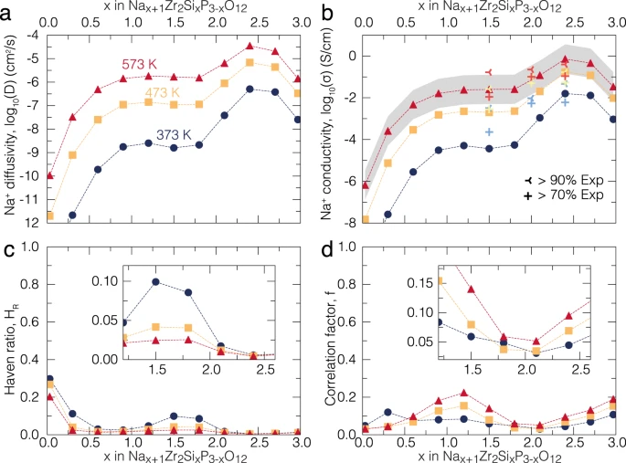

.. image:: _static/kmcpy_logo.png
   :width: 300 px
   :alt: kMCpy
   :align: center
==================================================================================
kMCpy: A python package to simulate transport properties using Kinetic Monte Carlo
==================================================================================

kMCpy is an open source python based package intended to study the migration of atoms using the kinetic
Monte Carlo technique. kMCpy provides an all python, systematic way to compute kinetic properties, which can be readily used for investigation, development, and prediction of new functional materials. 

This package includes a local cluster expansion model toolkit, a rejection-free kinetic Monte Carlo (rf-kMC) solver, and several python classes to extract ion transport properties such as diffusivities and conductivities. 
The local cluster expansion model toolkit can be used to fit a model from barrier calculated from first-principles or any other empirical methods. Following the training process
the local cluster expansion model can compute migration barriers in crystalline materials within the transition state theory.

Some of the advantages of using this package are:

1. kMCpy is fully based on python and is modular which makes it developer centric thus facilitating quick addition of new features.

2. It is cross-platform and supports most operating systems such as Windows, macOS, and Linux.

3. Intensive kMC routines has been optimized into machine code in the fly using `Numba <https://numba.pydata.org/>`_, which results in manifold increase in performance. 

This code has been recently used to explore `the transport properties of Na-ion in NaSICON solid electrolyte <https://www.nature.com/articles/s41467-022-32190-7>`_.
Some of the relevant aspects of the code from the mentioned paper are shown below. 

The rf-kMC as a part of this code was used to model the Na-ion conductivity in the :math:`Na_{1+x}Zr_2Si_xP_{3-x}O_{12}` which led to the discovery of maximum conductivity of the solid electrolyte is achieved for Na=3.4.

   
   Calculated Na+ diffusivity (a), conductivity (b), Haven's ratio (c) and averaged correlation factor (d) of :math:`Na_{1+x}Zr_2Si_xP_{3-x}O_{12}` at several temperatures: 373 (dark blue circles), 473 (orange squares) and 573 (red triangles) K, respectively. In panel (b), the computed ionic conductivities are compared with the experimental values of this work (Supplementary Fig. 6) at selected temperatures. Experimental values in (b) from this work are depicted with light blue (373 K), yellow (473 K), and red (573 K) crosses belonging to the same :math:`Na_{1+x}Zr_2Si_xP_{3-x}O_{12}` compositions but of pellets with different compacities (>70 and >90%, see legend).

.. toctree::
   :maxdepth: 1

   install
   modules/api
   about

